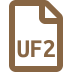

# Firmware for the Binepad keyboards
**&hellip; built on QMK, VIA or VIAL**

---

- Your product will ship with a working firmware.  Only use these if you're experiencing issues and only under the instruction of a Binepad support associate.
    - Please visit [binepad.com](https://binepad.com) for contact details.
- There is no need to pull request to this repository. The content is generated and updated only when needed.
    - Not all products will be listed.
    - Firmware is periodically rebuilt from the latest QMK / VIA / VIAL source code and committed here, if not available elsewhere.

---

## Getting custom firmware on your keyboard

Firmware files are stored in this folder and will be the file with the `.bin`, `.hex` or `.uf2` file extension (depending on the MCU used in the unit).  Each firmware will also have a changelog showing the release data in the files with the `.changelog.md` extension.

---

All firmware listed herein is build on one of 3 platforms, depending on the device:

| Platform | Website | Github repository | Configuration |
| --- | --- | --- | --- |
| QMK | [`qmk.fm`](https://qmk.fm/) | [`qmk/qmk_firmware`](https://github.com/qmk/qmk_firmware) | ~~[`config.qmk.fm`](https://config.qmk.fm/#/binepad/bnr1/v1/LAYOUT_ortho_1x1)~~ 1
| VIA 2 | [`caniusevia.com`](https://www.caniusevia.com/) | [`the-via/qmk_userspace_via`](https://github.com/the-via/qmk_userspace_via) | [`usevia.app`](https://usevia.app) 4 |
| VIAL 3 | [`get.vial.today`](https://get.vial.today) | [`vial-kb/vial-qmk`](https://github.com/vial-kb/vial-qmk) | [`vial.rocks`](https://vial.rocks) 4 |

> 1. QMK's configuration if for expert use only  
>    :warning: It only creates firmware binaries, and will break any dependencies with VIA or VIAL  
>    :bangbang: **Does not support encoders - firmware built here will not support rotation events.**  
> 2. VIA is a UI build around QMK and uses the QMK core code to compile custom firmware  
> 3. VIAL is a fork of the original QMK and uses its own derivative code to compile custom firmware  
> 4. These UI tools will require the Chrome browser, or browsers built on the Chromium platform  
>    :warning: Although both VIA and VIAL are derivatives of QMK they are not cross compatible. i.e. a VIAL compiled keyboard firmware will not work with VIA.

## Firmware

<table>
  <thead>
    <tr>
      <th colspan="2" rowspan="2" align="center">Product</th>
      <th colspan="2" align="center">Firmware</th>
      <th rowspan="2" align="center">Change Log</th>
    </tr>
    <tr>
      <th align="center"><small>Built on</small> QMK <small>for</small> VIA</th>
      <th align="center"><small>Built on</small> VIAL-QMK</th>
    </tr>
  </thead>
  <tbody>
    <tr>
      <td colspan="2">BN003</td>
      <td></td>
      <td align="center"></td>
      <td align="center"></td>
    </tr>
    <tr>
      <td colspan="2">BN006</td>
      <td></td>
      <td align="center"></td>
      <td align="center"></td>
    </tr>
    <tr>
      <td rowspan="2">BN009</td>
      <td>r1</td>
      <td rowspan="2"></td>
      <td align="center"></td>
      <td rowspan="2" align="center"></td>
    </tr>
    <tr>
      <td>r2</td>
      <td align="center"></td>
    </tr>
    <tr>
      <td colspan="2">BNK8</td>
      <td align="center"></td>
      <td></td>
      <td align="center"></td>
    </tr>
    <tr>
      <td colspan="2">BNK9</td>
      <td align="center"></td>
      <td></td>
      <td align="center"></td>
    </tr>
    <tr>
      <td rowspan="2">BNR1</td>
      <td>v1</td>
      <td rowspan="2"></td>
      <td align="center"></td>
      <td rowspan="2" align="center"></td>
    </tr>
    <tr>
      <td>v2</td>
      <td align="center"></td>
    </tr>
    <tr>
      <td colspan="2">CandyPad</td>
      <td align="center"></td>
      <td></td>
      <td align="center"></td>
    </tr>
    <tr>
      <td colspan="2">KN01</td>
      <td></td>
      <td align="center"></td>
      <td align="center"></td>
    </tr>
    <tr>
      <td colspan="2">KnobX1</td>
      <td></td>
      <td align="center"></td>
      <td align="center"></td>
    </tr>
    <tr>
      <td colspan="2">Pixie</td>
      <td align="center"></td>
      <td></td>
      <td align="center"></td>
    </tr>
  </tbody>
</table>

:bangbang: **NB:** You may need the [QMK Toolbox](https://qmk.fm/toolbox) app to install the Firmware in `.bin` and `.hex` formats.

<!--

## VIA `json`'s

VIA as a UI is maintained by an unaffiliated group on GitHub, and as such posting updates to the VIA `json` files is not as fast as we need sometimes.  With that in mind, if we release a new variation of the firmware that uses **additional** VIA features then you will need to sideload below `json`'s to access them.

| Product | Version5 | VIA `json` |
|:---:|:---:|:---:|
| BNK8 | 2 |  |
| BNK9 | 2 |  |

> 5. Version here means the version specifier internal to the VIA protocol within the firmware

-->

## License and Source

- The licence for QMK (and its offspring) is [GNU GPL 2.0](./LICENSE.md)
- Source for these firmware is compiled from their respective repositories, and the Binepad Global QMK Custom Userspace located at [`github.com/binepad-global/qmk_userspace_binepad`](https://github.com/binepad-global/qmk_userspace_binepad)

## Facing issues?

If you encounter any issues or bugs while using the devices, please report them via the contacts page listed on the [binepad.com](https://binepad.com) site. This will help in tracking down and resolving problems, and improve the experience for everyone.

---
